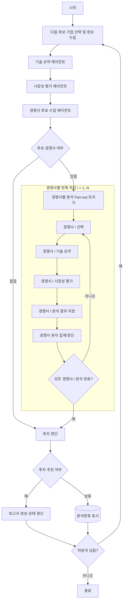

# FinTech AI Startup Investment Evaluation Agent
본 프로젝트는 FinTech 시장 내 인공지능 스타트업에 대한 투자 가능성을 자동으로 평가하는 LangGraph 기반 에이전트를 설계하고 구현한 실습 프로젝트입니다.

## Overview

## Overview

- **Objective**: 한국 AI 핀테크 스타트업의 원천 기술력, 시장성, 경쟁력을 종합 분석하여 투자 적합성 판단
- **Method**: Multi-Agent Pipeline + LLM Structured Output + Agentic RAG + Web Search
- **Tools**: Tavily Search API, OpenAI GPT-4o/4o-mini, LangGraph StateGraph, FAISS Vector Store, Pydantic Schema

## Features

- 한국 AI 핀테크 스타트업 자동 탐색 및 수집
- 구체적 AI/ML 알고리즘, 모델, 프레임워크 식별 (XGBoost, BERT, Transformer 등)
- 기술 블로그, 특허, 논문 등 다중 소스 정보 수집 및 분석
- Agentic RAG 파이프라인: Query Rewrite → PDF 검색 → 관련성 체크 → 웹 검색 → 평가 생성
- PDF 리포트 우선 검색 및 자동 웹 검색 Fallback
- LLM 기반 구조화된 데이터 추출 (Pydantic 스키마 검증)
- 제품/서비스별 기술적 강점과 한계점 자동 분석
- 다차원 투자 평가 (ROI, 기술경쟁력, 시장성, 경쟁우위, 팀역량, 리스크)
- 가중치 기반 최종 투자 판단 (Invest/Hold/Review)
- 시장 규모(TAM/SAM/SOM), 성장률(CAGR), 경쟁 환경, 규제 현황 종합 분석
- 기술력 정량 평가 (tech_score 0-100) 및 시장성 평가 (market_score 0-10)
- 중복 제거 및 관련도 스코어링 (AI/Fintech 키워드 기반)
- 2025년 기준 최신 정보 우선 반영
- 에이전트 간 State 기반 데이터 전달 (확장 가능한 파이프라인)
- 한국 기업 특화 필터링 (해외 기업 자동 제외)
- CompanyDetail 구조로 회사 + 제품 정보 통합 관리

## Tech Stack

| Category          | Details                                    |
|-------------------|--------------------------------------------|
| Framework         | LangGraph, LangChain, Python 3.11+        |
| LLM               | GPT-4o (Advanced), GPT-4o-mini (Standard) |
| Search Engine     | Tavily Search API (Advanced Search)       |
| Vector Store      | FAISS (PDF Retrieval)                     |
| Embeddings        | OpenAI Embeddings                         |
| Data Validation   | Pydantic v2 (BaseModel + ConfigDict)      |
| State Management  | LangGraph StateGraph + MemorySaver        |
| Structured Output | LangChain with_structured_output          |
| RAG Components    | PyPDFLoader, RecursiveCharacterTextSplitter |
| Evaluation        | GroundednessChecker (Relevance Check)     |
| Environment       | python-dotenv                             |
| Tools Integration | LangChain Tavily Search Tool              |
| Data Models       | Company, Product, CompanyDetail, MarketEvaluation schemas |

## Agents
 
- Agent 1 _startup_search: 스타트업 탐색 (Startup Search)
  - **목적**: 한국의 AI 핀테크 스타트업을 자동으로 발견하고 수집
  - **핵심 기능**:
    - 2025년 기준 최신 정보 우선 반영
    - 한국 기업만 선별 (해외 기업 제외)
    - AI 기술 핵심 활용 여부 검증
    - 다양한 검색어 조합으로 포괄적 탐색

- Agent 2_ai_tech_summary_single: 원천 기술 분석 (AI Tech Summary)
  - **목적**: 선별된 스타트업의 구체적인 AI 원천 기술을 분석하고 요약
  - **핵심 기능**:
    - "AI 활용" 같은 일반적 표현 배제, 구체적 기술만 추출
    - 정보 부족 시 빈 리스트 반환으로 과장 방지
    - 다음 에이전트로 전달 가능한 구조화된 데이터 생성

- Agent 3_tech_summary: 기술력 종합 평가 (Tech Summary & Scoring)
  - **목적**: 스타트업의 AI/ML 기술 스택을 심층 분석하고 기술력을 정량화
  - **핵심 기능**:
    - 검색 결과 기반 분석 (추측 금지)
    - Structured Output과 레거시 방식 모두 지원
    - 관련 문서 자동 필터링 및 정규화
    - 시장 평가 에이전트로 데이터 전달 준비 완료

- Agent 4_ market_evaluation : 시장성 종합 평가 (Market Evaluation with Agentic RAG)
  - **목적**: Agentic RAG 기반 PDF 리포트 및 웹 검색을 통한 정밀 시장성 분석
  - **핵심 기능**:
    - Agentic RAG 5단계 파이프라인 (Rewrite → PDF 검색 → 관련성 체크 → 웹 검색 → 평가 생성)
    - Query Rewrite로 검색 쿼리 최적화 (핵심 키워드 강조)
    - PDF 리포트 우선 검색 (FAISS 벡터 검색)
    - 관련성 낮을 시 자동 웹 검색 Fallback (Tavily API)
    - Legacy 모드 Fallback 지원
    - Pydantic 기반 구조화된 시장 평가 (TAM/SAM/SOM, CAGR, 경쟁사, 규제)
    - 경쟁사 목록에서 대상 회사 자동 제외

- Agent 5 (competitor_compare): 경쟁사 비교 분석 (Competitor Comparison)
  - **목적**: 주요 경쟁사 대비 대상 스타트업의 차별화 요소 및 경쟁 우위 평가
  - **핵심 기능**:
    - 다층 문서 수집 전략 (market_store → startup_search → Tavily 검색)
    - 경쟁사별 제품 초점, 기술 차별점, Go-to-Market 전략 분석
    - 강점/약점 및 시장 포지셔닝 자동 추출
    - 대상 회사명 정규화 및 경쟁사 목록에서 자동 제외
    - 기술 점수 가중 적용한 경쟁 우위 점수(edge_score 0-100) 산출

- Agent 6 (investment_decision): 최종 투자 판단 (Investment Decision)
  - **목적**: 모든 에이전트 분석 결과를 통합하여 최종 투자 의사결정 도출
  - **핵심 기능**:
    - Fintech 방식 (0-5점) 및 Legacy 방식 (0-100점) 이중 평가 시스템
    - 6개 항목 가중치 평가 (ROI 20%, 기술경쟁력 20%, 시장성 20%, 경쟁우위 15%, 팀역량 15%, 리스크 10%)
    - 항목별 상세 breakdown (점수, 가중치, 가중점수, 설명)
    - 투자 기준 점수 기반 자동 의사결정 (Invest ≥3.5 / Hold <3.5)
    - LLM 기반 투자 판단 근거 자동 생성
    - 자동 점수 척도 변환 (0-100 → 0-5)

- Agent 7 (report_generator): 종합 보고서 생성 (Report Generator)
  - **목적**: 전체 분석 결과를 Markdown 및 PDF 형식의 전문 투자 보고서로 통합
  - **핵심 기능**:
    - Markdown 및 PDF 이중 포맷 보고서 자동 생성
    - Executive Summary LLM 자동 정제 (3-5개 불릿 포인트)
    - 다중 에이전트 출처 통합 및 중복 제거 (최대 10개)
    - 한글 폰트 지원 PDF 생성 (AppleGothic)
    - Fintech/Legacy 모드 자동 감지 및 맞춤 테이블 생성
    - 7단계 구조화된 보고서 (요약, 개요, 기술, 시장, 경쟁사, 투자판단, 출처)


## Architecture



## Directory Structure
```
ai_agent_project/
ai_agent_project/
├── app_graph.py                # 전체 평가 파이프라인 메인 스크립트
├── agents/                     # 각 단계별 분석 에이전트 모듈
│   ├── startup_search.py       # 1️⃣ 스타트업 탐색: 웹 기반으로 유망 기업 10개 수집
│   ├── ai_tech_summary_single.py # 2️⃣ AI 기술 필터링: 수집된 스타트업 중 AI 원천 기술 보유 기업 선별
│   ├── tech_summary.py         # 3️⃣ 기술 분석: 핵심 기술력, 구현 방식, 기술 성숙도 평가
│   ├── market_evaluation.py    # 4️⃣ 시장 평가: TAM·SAM·SOM 및 성장성·수요 전망 분석
│   ├── competitor_compare.py   # 5️⃣ 경쟁사 분석: 주요 경쟁사와의 기술·시장 차별성 평가
│   ├── investment_decision.py  # 6️⃣ 투자 판단: 종합 점수 기반 투자 적합성 판단
│   └── report_generator.py     # 7️⃣ 보고서 생성: 단계별 결과 통합 및 최종 투자 보고서 생성
├── data/                       # 참고 데이터 및 산업 리포트(PDF)
│   ├── KIFIR2025-03.pdf        # 한국금융연구원: Green FinTech 동향
│   ├── KMPG_report.pdf         # 삼정KPMG: Business Focus 2025 - 디지털 금융 주요 이슈
│   └── miraeasset_FinTecj.pdf  # 미래에셋투자연구소: 핀테크 산업 전망
└── outputs/                    # 평가 결과 및 생성된 보고서 저장 디렉터리
```

## Contributors 
- 김세희 : 
- 민경현 : 
- 송수아 : 
- 윤현선 :  


